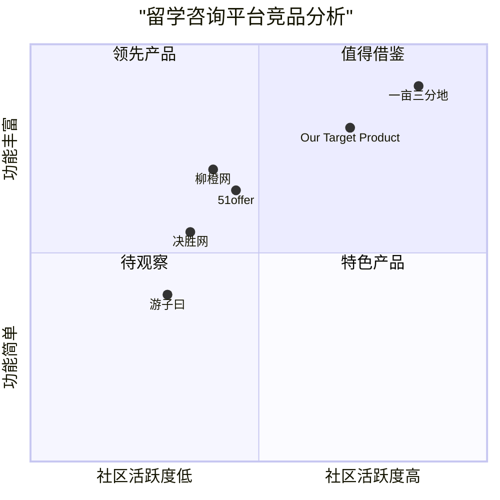

# 留学咨询和职业发展网站产品需求文档（PRD）

## 1. 项目概述

### 1.1 项目信息
- 项目名称：study_career_hub
- 编程语言：React, JavaScript, Tailwind CSS
- 项目类型：Web应用
- 原始需求：主要用途是分享留学和职业发展咨询，功能包括用户注册登录、内容展示、留言板等

### 1.2 产品目标
1. 打造一站式留学咨询和职业发展平台，满足学生从留学规划到职业发展的全周期需求
2. 建立活跃的用户社区，促进信息分享和经验交流
3. 提供高质量的留学咨询和职业发展内容，帮助用户做出更好的决策


### 1.3 用户故事
1. 作为一名准备申请留学的大学生，我希望能够获取真实可靠的留学申请经验分享，以便更好地规划我的申请策略
2. 作为一名即将毕业的留学生，我想了解各个公司的内推信息和面试经验，以便增加求职成功率
3. 作为一名刚到海外的新生，我希望能够找到相似背景的学长学姐交流经验，以便更快适应海外生活
4. 作为一名职场新人，我想了解不同行业的发展路径和经验分享，以便做出更好的职业规划

### 1.4 竞品分析

#### 主要竞品
1. 一亩三分地
   - 优势：
     * 用户基础庞大，社区氛围活跃
     * 内容覆盖面广，从留学到职业发展的全生命周期
     * 积分制度设计合理，促进用户贡献
   - 劣势：
     * 界面设计较为传统
     * 信息整理不够系统化
     * 商业化程度较高

2. 柳橙网
   - 优势：
     * 服务流程标准化
     * 信息透明度高
   - 劣势：
     * 社区互动性不足
     * 内容深度不够

3. 51offer
   - 优势：
     * DIY留学工具丰富
     * 数据分析能力强
   - 劣势：
     * 社区活跃度不高
     * 职业发展内容较少


4. 决胜网
   - 优势：
     * 信息聚合能力强
     * 搜索功能完善
   - 劣势：
     * 用户粘性不足
     * 个性化服务欠缺

5. 游子曰
   - 优势：
     * 内容专业性强
     * 用户评价真实
   - 劣势：
     * 覆盖范围较窄
     * 功能相对单一

#### 竞品象限图


## 2. 功能需求

### 2.1 核心功能模块

#### 2.1.1 用户账户系统 (P0)
- 用户注册与登录
  * 邮箱注册和验证
  * 第三方账号登录（微信、Google）
  * 用户个人资料管理
  * 隐私设置

- 会员体系
  * 普通用户
  * VIP会员
  * 认证用户（在读学生、校友、行业专家）

- 积分系统
  * 发帖获取积分
  * 优质回答奖励
  * 积分兑换特权


#### 2.1.2 内容管理系统 (P0)
- 板块分类
  * 留学申请
  * 签证信息
  * 院校选择
  * 专业介绍
  * 求职就业
  * 生活经验

- 内容发布
  * 富文本编辑器
  * 图片上传
  * 文档分享
  * 标签系统

- 内容管理
  * 内容审核
  * 举报处理
  * 敏感词过滤
  * 内容置顶

#### 2.1.3 社区互动系统 (P0)
- 评论系统
  * 多级评论
  * 点赞功能
  * 回复通知

- 私信系统
  * 用户间私信
  * 消息提醒
  * 屏蔽功能

- 关注系统
  * 关注用户
  * 关注话题
  * 动态提醒

#### 2.1.4 搜索系统 (P1)
- 全文搜索
- 标签筛选
- 高级搜索
- 搜索历史记录

#### 2.1.5 数据统计系统 (P1)
- 用户行为分析
- 内容热度统计
- 活跃度统计
- 用户增长分析


### 2.2 增值功能模块

#### 2.2.1 求职板块 (P1)
- 内推信息发布
- 简历修改建议
- 面试经验分享
- 职业发展规划

#### 2.2.2 学习资源 (P2)
- 备考资料分享
- 语言学习资源
- 专业课程推荐
- 学习经验交流

#### 2.2.3 生活服务 (P2)
- 租房信息
- 二手交易
- 本地活动
- 校友活动

## 3. 技术要求

### 3.1 系统架构
- 前端：React + JavaScript + Tailwind CSS
- 响应式设计，支持移动端访问
- CDN加速
- 分布式存储

### 3.2 性能要求
- 页面加载时间：<3秒
- 并发用户：>10000
- 系统可用性：99.9%
- API响应时间：<500ms

### 3.3 安全要求
- 用户数据加密存储
- 防SQL注入
- XSS防护
- CSRF防护
- 敏感信息脱敏


## 4. UI设计建议

### 4.1 首页布局
```ascii
+------------------------+
|        Header          |
|  Logo    Search   User |
+------------------------+
|    Navigation Menu     |
+------------------------+
|      Hot Topics    |S  |
|                    |i  |
|    Latest Posts    |d  |
|                    |e  |
|    Featured        |b  |
|    Content         |a  |
|                    |r  |
+------------------------+
|        Footer          |
+------------------------+
```

### 4.2 内容页布局
```ascii
+------------------------+
|        Header          |
+------------------------+
|    Breadcrumb Nav     |
+------------------------+
| Content  |   Sidebar   |
|          | - Related   |
|          | - Hot       |
|          | - Author    |
+------------------------+
| Comments Section       |
+------------------------+
|        Footer          |
+------------------------+
```

## 5. 开发计划

### 5.1 第一阶段 (2个月)
- 用户系统开发
- 基础内容系统
- 基础UI实现

### 5.2 第二阶段 (2个月)
- 社区互动系统
- 搜索功能
- 会员体系

### 5.3 第三阶段 (2个月)
- 增值功能开发
- 性能优化
- 系统测试

## 6. 运营建议

### 6.1 用户增长
- 社交媒体推广
- SEO优化
- 内容运营
- 用户激励计划

### 6.2 社区运营
- 签约优质创作者
- 定期举办活动
- 建立版主制度
- 内容质量管理

### 6.3 商业化方向
- VIP会员订阅
- 广告投放
- 增值服务
- 校企合作

## 7. 风险评估

### 7.1 潜在风险
1. 用户增长速度不及预期
2. 内容质量控制难度大
3. 社区氛围管理挑战
4. 商业模式变现周期长

### 7.2 应对策略
1. 制定详细的用户增长计划
2. 建立严格的内容审核机制
3. 设立专职社区管理团队
4. 多元化收入来源规划

## 8. 待解决问题

1. 如何保证内容的真实性和可靠性？
2. 如何平衡免费内容和付费内容的比例？
3. 如何提高用户的参与度和粘性？
4. 如何处理可能的法律风险？
5. 如何与现有平台形成差异化竞争？
